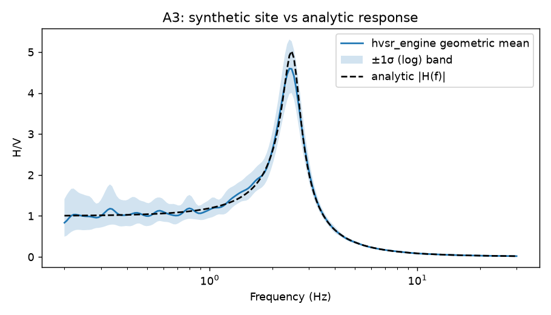
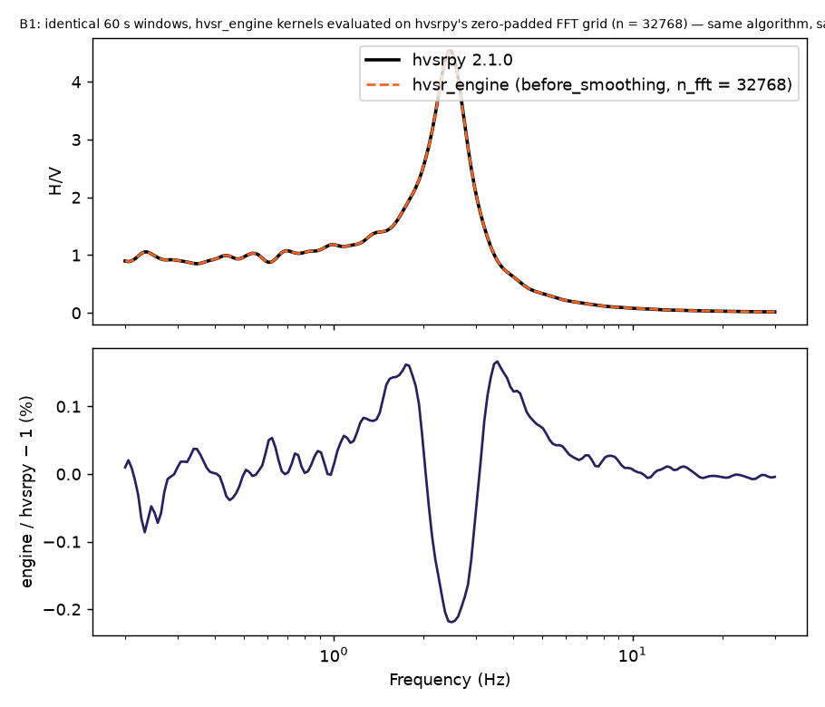
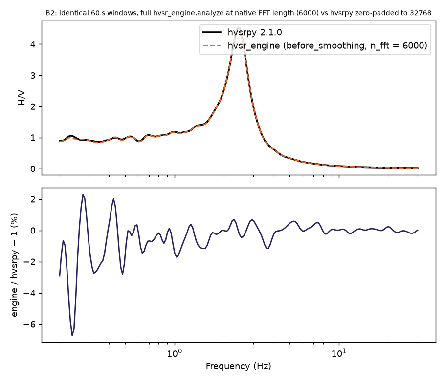
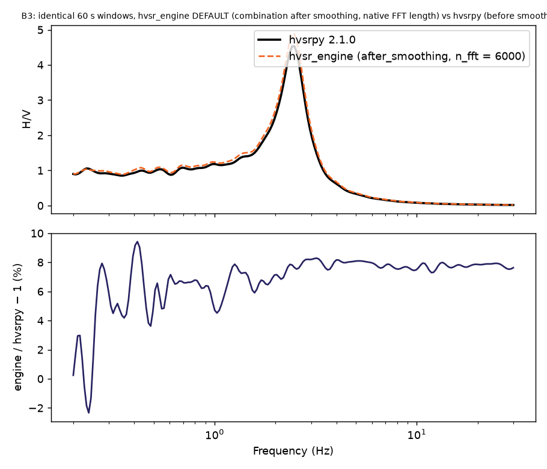

# Numerical validation

Generated by `engine/validation/run_validation.py`. All inputs are **synthetic** (no field data).
Engine and dependency versions: `{"engine": "1.0.0", "python": "3.12.14", "numpy": "2.5.3", "scipy": "1.18.1", "obspy": "1.5.1", "pandas": "2.3.3", "matplotlib": "3.11.2"}`.

## Part A — analytic and synthetic reference cases

| ID | Case | Metric | Value | Tolerance | Result |
|---|---|---|---|---|---|
| A1 | Constant ratio N = E = 2·Z (identical noise) | max \|HVSR − 2\| over 0.2–30 Hz | 1.33e-15 | 1e-09 | PASS |
| A2 | RMS combination N = 3Z, E = Z → √5 | max \|HVSR − √5\| | 1.78e-15 | 1e-09 | PASS |
| A3a | Synthetic 1-DOF site (f0 = 2.5 Hz, A0 = 5): mean curve vs analytic \|H(f)\| | median relative deviation, 0.5–20 Hz | 0.0155 | 0.05 | PASS |
| A3b | same | max relative deviation, 0.5–20 Hz (largest at the resonance, where K–O smoothing lowers the peak) | 0.089 | 0.2 | PASS |
| A3c | same | \|f0 − 2.5\| / 2.5 | 0.0325 | 0.05 | PASS |
| A4 | Rotation of a pure-N signal by 90° → pure E | max abs error | 6.12e-17 | 1e-12 | PASS |
| A5 | Konno–Ohmachi smoothing of a flat spectrum (b = 40) | max \|smoothed − 1\| | 2.22e-15 | 1e-12 | PASS |
| A6 | Butterworth low-pass, 10 Hz, order 4 (single pass) | \|gain at cutoff + 3.01 dB\| | 0.000567 | 0.05 | PASS |
| A7 | Decimation 200 → 50 Hz of 1 Hz + 45 Hz sinusoids (45 Hz must vanish, 1 Hz stay aligned) | max abs error vs 1 Hz reference | 0.000685 | 0.02 | PASS |
| A8 | Vertical spectrum zeroed between 3–8 Hz | bins 4.5–5.5 Hz reported null and no ratio > 100 | 12 | — | PASS |

Notes: A3 compares the geometric-mean HVSR of a synthetic 1-DOF site against the analytic
transmissibility |H(f)| that generated it. The residual is largest at the resonance because
Konno–Ohmachi smoothing (b = 40) averages over a finite band and lowers a sharp peak; away from
the peak the agreement is at the percent level and is limited by the finite number of windows.

## Part B — cross-check against hvsrpy

Reference implementation: hvsrpy 2.1.0 (J. P. Vantassel, MIT licence), `HvsrTraditional` workflow, on `synthetic_site_A_2p5Hz.txt`.
Common settings: taper = Tukey 0.1 (5 % per side); detrend = linear per window; smoothing = Konno–Ohmachi b = 40; frequencies = 200 log-spaced 0.2–30.0 Hz; horizontal = geometric mean; screening = none; overlap = 0 (identical windows cut by hvsr_engine were handed to hvsrpy).

| ID | Windows | Engine combination stage | max rel. diff. (all f) | max rel. diff. (f ≥ 1 Hz) | median rel. diff. | max \|Δ σ_ln\| | f0 engine / hvsrpy | A0 engine / hvsrpy |
|---|---|---|---|---|---|---|---|---|
| B1 | 20 × 60 s | before_smoothing | 0.22 % | 0.22 % | 0.026 % | 3.0e-03 | 2.481 / 2.481 Hz | 4.522 / 4.532 |
| B2 | 20 × 60 s | before_smoothing | 6.71 % | 1.71 % | 0.278 % | 7.5e-02 | 2.419 / 2.481 Hz | 4.535 / 4.532 |
| B3 | 20 × 60 s | after_smoothing | 9.42 % | 8.29 % | 7.545 % | 7.8e-02 | 2.419 / 2.481 Hz | 4.885 / 4.532 |

* **B1** — identical 60 s windows, hvsr_engine kernels evaluated on hvsrpy's zero-padded FFT grid (n = 32768) — same algorithm, same grid.
* **B2** — identical 60 s windows, full hvsr_engine.analyze at native FFT length (6000) vs hvsrpy zero-padded to 32768.
* **B3** — identical 60 s windows, hvsr_engine DEFAULT (combination after smoothing, native FFT length) vs hvsrpy (before smoothing).

### Algorithmic differences (explained, not forced away)

* **B1 (same algorithm, same FFT grid).** With identical windows, the same zero-padded FFT grid and horizontal combination before smoothing, both codes implement the same computation. The residual difference comes from hvsrpy truncating the Konno–Ohmachi window to |b·log10(f/fc)| ≤ 3 (essentially the main lobe), whereas hvsr_engine keeps the full window (weights < 1e-8 truncated). The effect is largest at the lowest frequencies where the window spans only a few FFT bins.
* **B2 (zero-padding).** hvsrpy zero-pads every window to the next power of two before the FFT (≥ 32768 samples; 6000 → 32768 here), which sinc-interpolates the raw spectrum onto a finer grid before smoothing. hvsr_engine transforms the window at its native length (frequency resolution 1/window length). The smoothed curves differ by a few percent per window; the difference averages down over windows.
* **B3 (combination stage — the intended difference).** hvsrpy combines the horizontal amplitude spectra (geometric mean) *before* smoothing; hvsr_engine's default combines *after* smoothing each component. For noise-like spectra, E[√(N·E)] < √(E[N]·E[E]) (Jensen's inequality; for independent Rayleigh-distributed amplitudes the ratio is ≈ 0.93), so combining before smoothing biases the curve low by ≈ 7 % — this is why hvsr_engine's default agrees with the analytic reference in Part A (A3, median deviation ≈ 1.5 %) while the before-smoothing variant sits systematically lower. The stage is recorded in every result and can be switched (`combination_stage`).
* **Windowing.** hvsrpy's own `preprocess` cuts 60 s windows of 6001 samples (end-inclusive); hvsr_engine cuts 6000. Identical windows were used above to isolate the spectral algorithms.
* **Statistics.** Both report the log-normal mean and std(ln H/V) with ddof = 1; the σ_ln columns agree to the level implied by the curve differences.
